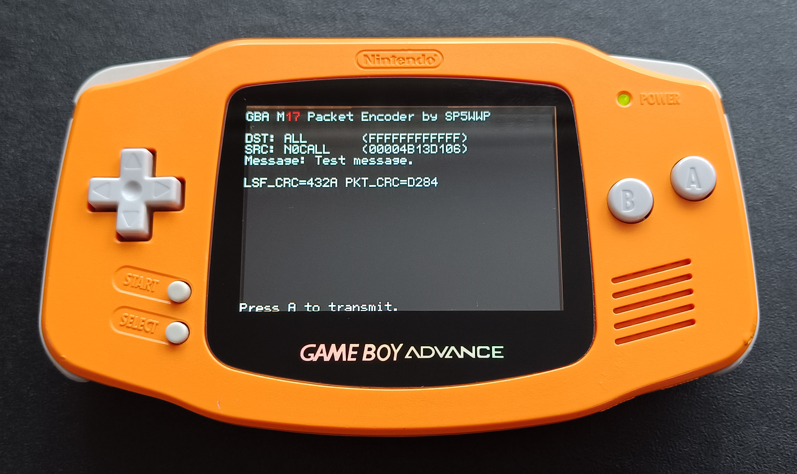
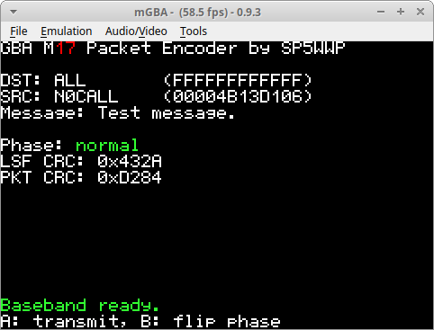
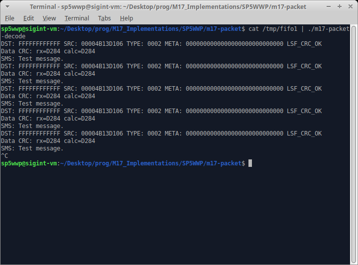

# gba_m17

## Disclaimer
This is a side-project created *only* for fun. There's no warranty that the code supplied within this repository is going to work on your device. The point of it is to show how versatile and portable [libm17](https://github.com/M17-Project/libm17) (and the M17 protocol itself) is. The repeatability of it is low due to the fact that GBAs are obsolete and aren't manufactured anymore.

## Preview

## Compiling
Prerequisite: `gcc-arm-none-eabi`. 
Make sure you clone the repository with `--recursive` as it uses libm17 as a submodule.

The procedure is standard:
1. `cd` into the root directory.
2. Run `make`.

`out_fixed.gba` build artifact should be generated after issuing `make`.

Additionally, you can run `make test` afterwards to give the freshly generated ROM a test.

## Running the ROM
**Note:** The ROM can be renamed to something more meaningful than `out_fixed`.
### Running on a Gameboy Advance (through EZ-FLASH or other means)
1. Copy the `out_fixed.gba` ROM file to the directory of your choice on the SD card.
2. Put the SD card back into its slot.
3. Run the ROM as usual.

### Running using the [mgba emulator](https://mgba.io/)
Simply run `mgba-qt out_fixed.gba` (or `mgba-sdl`, depending on which one you intend to use).

A window like the one shown below should appear.

## Usage
Press the **Start** button. The code should generate a valid baseband (160ms long) for the data displayed on the screen (with the selected phase setting). **A** button starts baseband playback, **B** button sets the signal's phase. The DST/SRC addresses are hardcoded.

## Final remarks
The output baseband signal can be accessed through the 3.5mm headphone port. The phase of the signal is inverted. The signal can be used to drive M17-compatible analog transceivers through their 9600-baud inputs. Some amplification might be necessary, as the peak-to-peak voltage value is just slightly over 0.4V (at volume set to maximum). A logic-level MOSFET such as the BSS138 could then be used to pull the PTT line down for transmission. Its gate can be triggered with a peak detector (a simple diode/capacitor circuit should work) if a baseband amplifier is used. 
Here is a scope screen dump of the baseband signal, as generated by a real hardware:

## Decoding the baseband using [m17-packet-decode](https://github.com/M17-Project/M17_Implementations/blob/main/SP5WWP/m17-packet/m17-packet-decode.c)
After passing the generated baseband through an appropriate [symbol synchronizer](https://wiki.gnuradio.org/index.php/Symbol_Sync), the resulting symbol stream can be decoded with `m17-packet-decode` supplied within the [reference M17 implementation](https://github.com/M17-Project/M17_Implementations):

